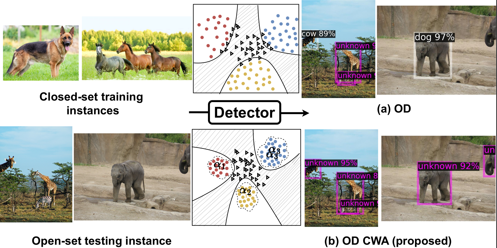
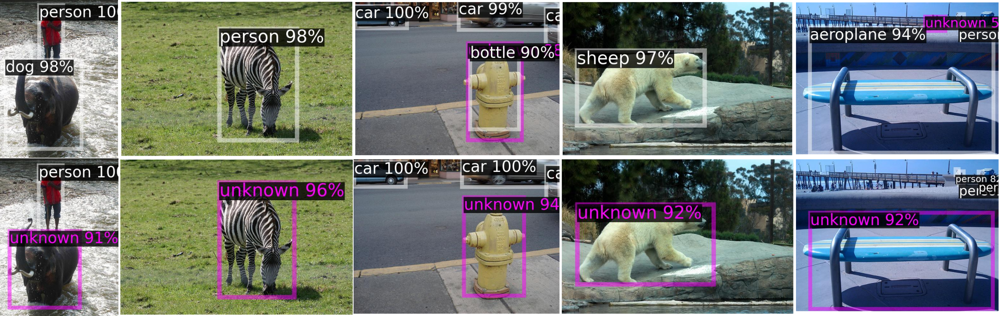
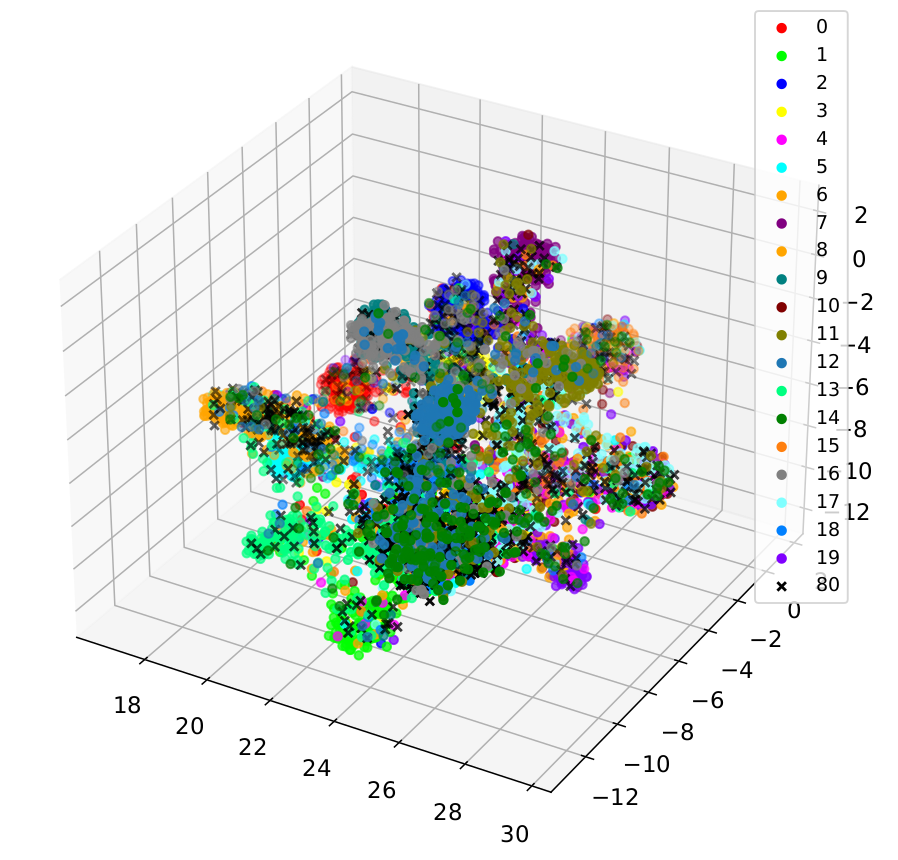
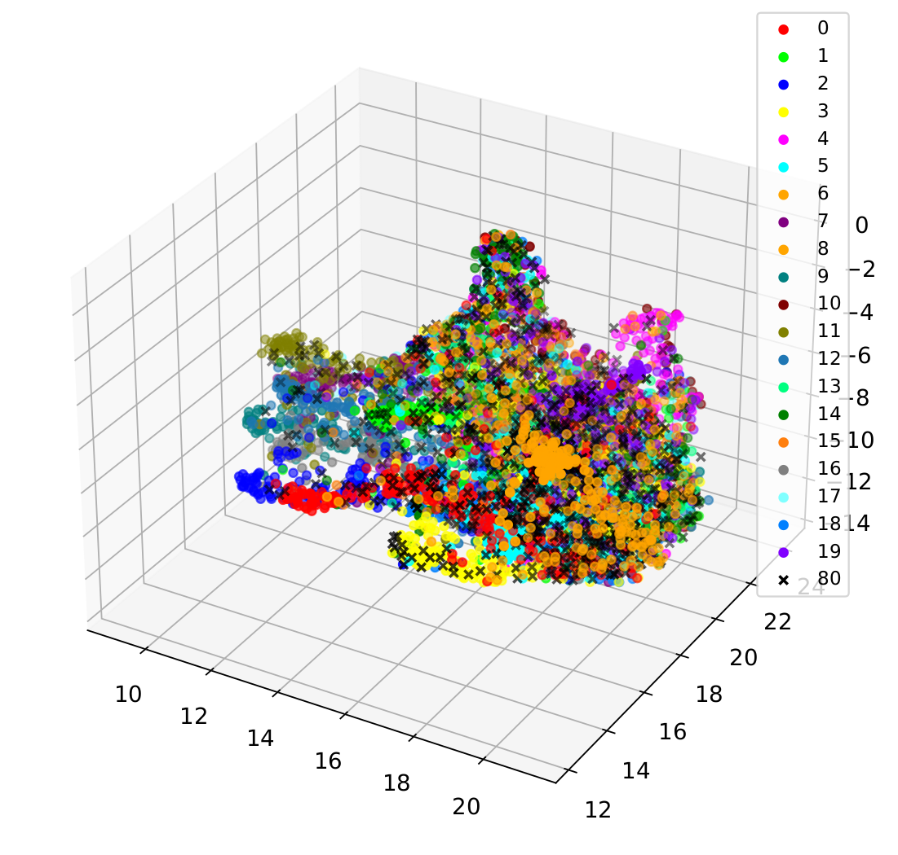

## OpenDet



> **Wasserstein Distance-based Expansion of Low-Density Latent Regions for Unknown Class Detection (CVPR2022)**<br>

OpenDet_CWA: OpenDet_CWA is implemented based on [detectron2](https://github.com/facebookresearch/detectron2) and [Opendet2] (https://github.com/csuhan/opendet2).

arXiv paper: [https://arxiv.org/abs/2003.08798](https://arxiv.org/abs/2003.08798)


### Illustration of OD-CWA framework


## Abstract
This paper addresses the significant challenge in open-set object detection (OSOD): the tendency of state-of-the-art detectors to erroneously classify unknown objects as known categories with high confidence. We present a novel approach that effectively identifies unknown objects by distinguishing between high and low-density regions in latent space. Our method builds upon the Open-Det (OD) framework, introducing two new elements to the loss function. These elements enhance the known embedding space's clustering and expand the unknown space's low-density regions. The first addition is the Class Wasserstein Anchor (CWA), a new function that refines the classification boundaries. The second is a spectral normalisation step, improving the robustness of the model. Together, these augmentations to the existing Contrastive Feature Learner (CFL) and Unknown Probability Learner (UPL) loss functions significantly improve OSOD performance. Our proposed OpenDet-CWA (OD-CWA) method demonstrates: a) a reduction in open-set errors by approximately 17%-22%, b) an enhancement in novelty detection capability by 1.5%-16%, and c) a decrease in the wilderness index by 2%-20% across various open-set scenarios. These results represent a substantial advancement in the field, showcasing the potential of our approach in managing the complexities of open-set object detection.


<p align="center" width="100%">

</p>

<p align="center" width="80%">
<strong>Figure:</strong> Qualitative comparisons between proposed OD (top) and OD-CWA (bottom). Both models are trained on VOC and the detection results are visualised using images from COCO. The purple colour represents unknown and white represents known. White annotations represent classes seen by the model and purple annotation correspond to unknown classes.
</p>


### Setup

The code is based on [detectron2 v0.5](https://github.com/facebookresearch/detectron2/tree/v0.5). 

* **Installation** 

Here is a from-scratch setup script.

```
conda create -n opendet_cwa python=3.8 -y
conda activate opendet_cwa
pip install torch==2.0.1+cu117 torchvision torchaudio -f https://download.pytorch.org/whl/torch_stable.html
pip install detectron2==0.5 -f https://dl.fbaipublicfiles.com/detectron2/wheels/cu101/torch1.8/index.html
git clone https://github.com/proxymallick/OpenDet_CWA.git
cd OpenDet_CWA
pip install -v -e .
```

* **Prepare datasets** 

Please follow [datasets/README.md](datasets/README.md) for dataset preparation. Then we generate VOC-COCO datasets.

```
bash datasets/opendet2_utils/prepare_openset_voc_coco.sh
# using data splits provided by us.
cp datasets/voc_coco_ann datasets/voc_coco -rf
```

### Model OD-CWA

# Results Summary

We report results on VOC and VOC-COCO-20, providing pretrained models. For full details, refer to the corresponding log file.

## Performance Metrics


### Model Zoo

We report the results on VOC and VOC-COCO-20, and provide pretrained models. Please refer to the corresponding log file for full results.

* **Faster R-CNN**

| Method       | backbone | mAP<sub>K&uarr;</sub>(VOC) | WI<sub>&darr;</sub> | AOSE<sub>&darr;</sub> | mAP<sub>K&uarr;</sub> | AP<sub>U&uarr;</sub> |  
|--------------|:--------:|:--------------------------:|:-------------------:|:---------------------:|:---------------------:|:--------------------:|  
| FR-CNN       |   R-50    | **80.10** | 18.39 | 15118 | **58.45** | -  | 
| PROSER       |   R-50   |            79.42           |        20.44        |         14266         |         56.72         |         16.99        |  
| ORE          |   R-50   |            79.80           |        18.18        |         12811         |         58.25         |         2.60         |  
| DS           |   R-50   |            79.70           |        16.76        |         13062         |         58.46         |         8.75         |  


**Swin-T**
| Method       | backbone | mAP<sub>K&uarr;</sub>(VOC) | WI<sub>&darr;</sub> | AOSE<sub>&darr;</sub> | mAP<sub>K&uarr;</sub> | AP<sub>U&uarr;</sub> |  
|--------------|:--------:|:--------------------------:|:-------------------:|:---------------------:|:---------------------:|:--------------------:|  
| OpenDet(OD)  |  Swin-T  |           **80.02** | 14.95 | 11286 | **58.75** | 14.93 |  
| OD-CWA   |  Swin-T  |        79.20 | **11.70** | **8748** | 57.58 | **15.36** | 
| OD-SN        |  Swin-T  |                      79.66 | **12.96**           | **9432**              | 57.86 | **14.78** | 


**Note**:
* The above codes and repo has been modified from [OpenDet2](https://github.com/csuhan/opendet2)
* There were issues installing and running Opendet2 from the instructions and this repo provides modified codes
* The above results are taken from the paper and not the reimplemented version mentioned in (https://github.com/csuhan/opendet2). 


### Train and Test

* **Testing**

First, you need to download pretrained weights in the model zoo, e.g., [OpenDet](https://drive.google.com/drive/folders/10uFOLLCK4N8te08-C-olRyDV-cJ-L6lU?usp=sharing).

Then, run the following command:
```
python tools/train_net.py --num-gpus 8 --config-file configs/faster_rcnn_R_50_FPN_3x_opendet.yaml \
        --eval-only MODEL.WEIGHTS output/faster_rcnn_R_50_FPN_3x_opendet/model_final.pth
```

* **Training**

The training process is the same as detectron2.
```
python tools/train_net.py --num-gpus 8 --config-file configs/faster_rcnn_R_50_FPN_3x_opendet.yaml
```

To train with the Swin-T backbone, please download [swin_tiny_patch4_window7_224.pth](https://github.com/SwinTransformer/storage/releases/download/v1.0.0/swin_tiny_patch4_window7_224.pth) and convert it to detectron2's format using [tools/convert_swin_to_d2.py](tools/convert_swin_to_d2.py).
```
wget https://github.com/SwinTransformer/storage/releases/download/v1.0.0/swin_tiny_patch4_window7_224.pth
python tools/convert_swin_to_d2.py swin_tiny_patch4_window7_224.pth swin_tiny_patch4_window7_224_d2.pth
```

* **Embedding projections of Knowns (ID: 1-20) and Unknowns (ID: 80) of OD-CWA (left) vs. OD-CWA (right)**




